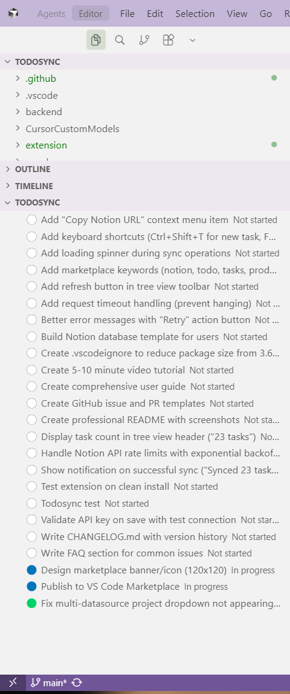
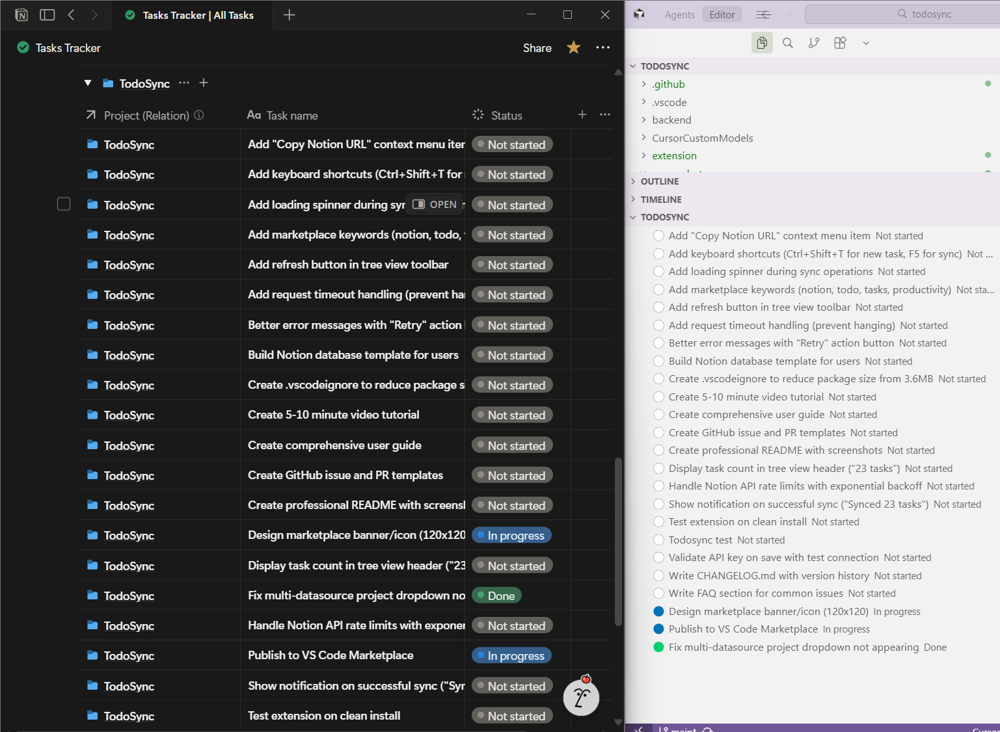
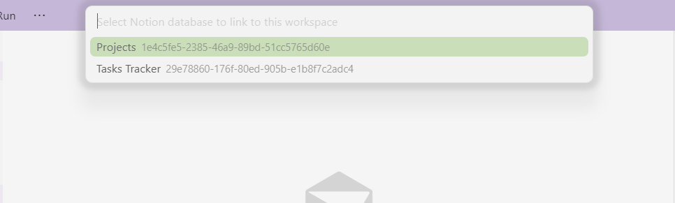
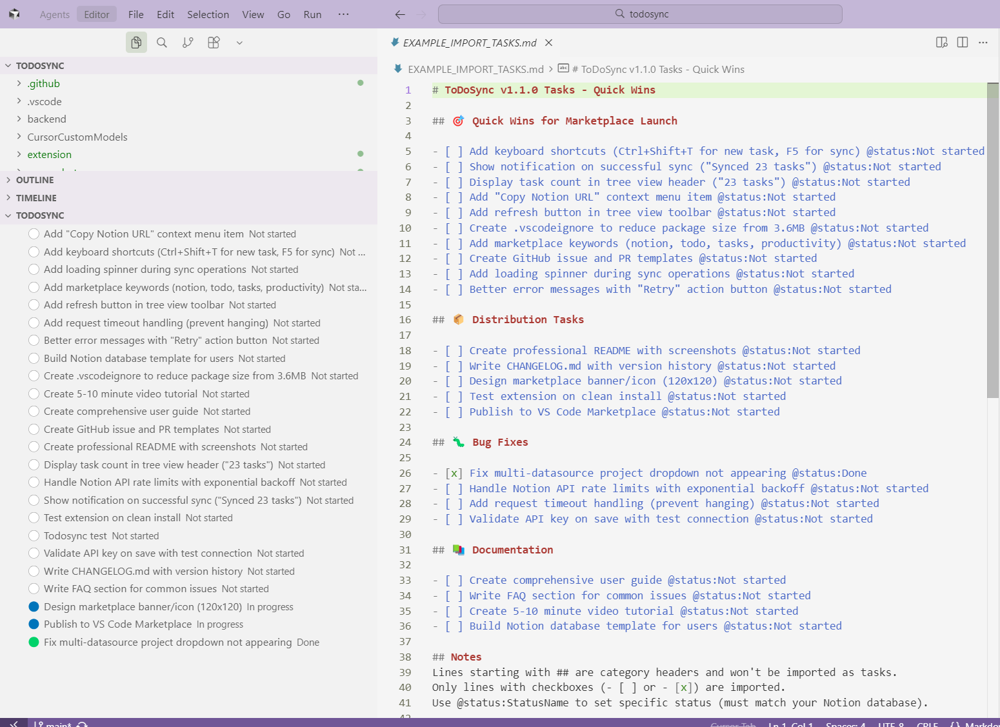
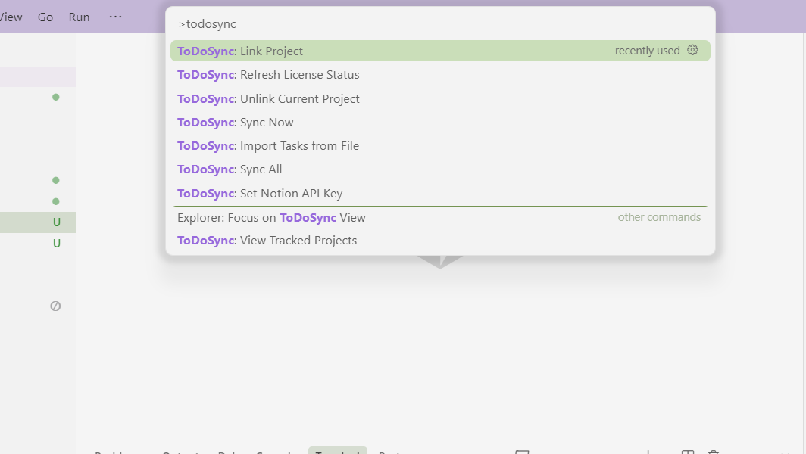
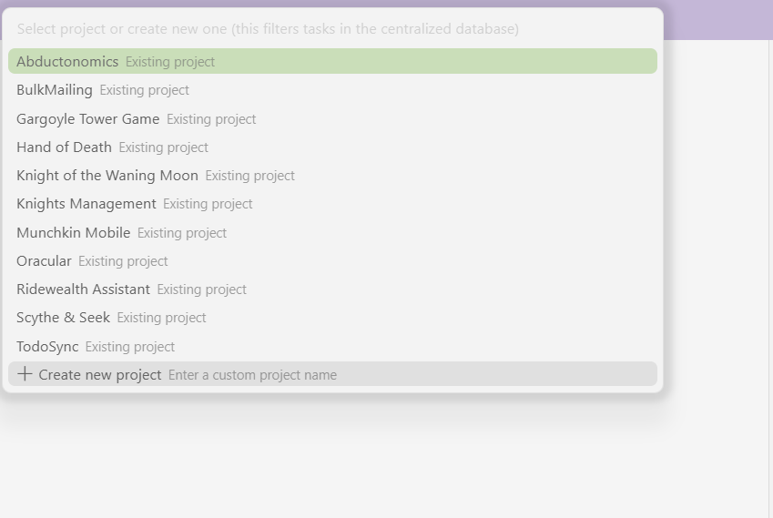
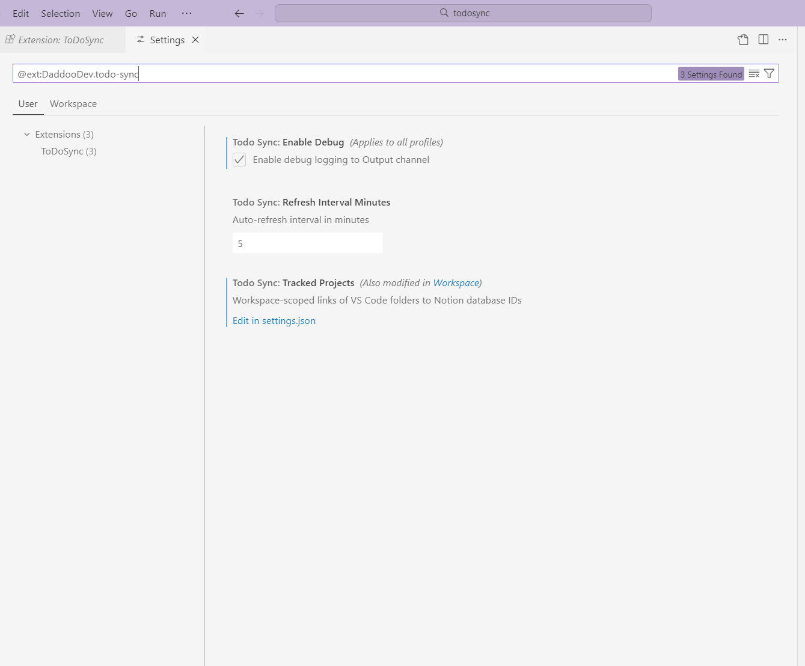

# ToDoSync - Notion Task Management for VS Code

Sync your VS Code workspace tasks directly with Notion databases. No local markdown files, Notion is your single source of truth.

## 📸 Screenshots

### Task Management in Your Sidebar

*Manage all your tasks directly in the VS Code sidebar with color-coded status indicators*

### Real-Time Notion Sync

*Changes sync instantly between VS Code and Notion - your tasks, everywhere*

### Centralized Project Management

*Select from existing projects or create new ones in your centralized Notion database*

### Bulk Import Tasks

*Import dozens of tasks in seconds from markdown files*

### Quick Command Access

*Access all ToDoSync features from the Command Palette*

### Project Management

*View and manage all your tracked projects*

### Simple Configuration

*Easy setup with minimal configuration required*

## ✨ Features

- **🔄 Bi-directional Sync** - Real-time sync between VS Code and Notion
- **📁 Centralized Mode** - Use ONE Notion database for ALL your projects with automatic filtering
- **🎯 Multi-Datasource Support** - Full support for Notion's advanced multi-datasource databases
- **📝 Bulk Import** - Import tasks from markdown files with simple checkbox format
- **🎨 Color-Coded Status** - Visual status indicators (⚪ Not started, 🔵 In progress, 🟢 Done)
- **⚡ Auto-Refresh** - Automatic sync every 5 minutes + on window focus
- **🔐 Secure** - API keys stored in VS Code SecretStorage or .env file
- **💎 Freemium** - Free tier (1 project) or Pro (unlimited projects)

## 📦 Installation

1. Install from VS Code Marketplace (search "ToDoSync")
2. Or install manually: Download `.vsix` file → Extensions → Install from VSIX

## 🚀 Quick Start

### 1. Get Your Notion API Key

1. Go to [Notion Integrations](https://www.notion.so/my-integrations)
2. Click **+ New integration**
3. Name it "ToDoSync" and select your workspace
4. Copy the **Internal Integration Token**
5. In Notion, **share your database** with the integration

### 2. Set Up in VS Code

1. Open Command Palette (`Ctrl+Shift+P`)
2. Run: `ToDoSync: Set Notion API Key`
3. Paste your API key
4. Run: `ToDoSync: Link Project`
5. Select your Notion database
6. Select a project (or create new one)
7. Done! Tasks will appear in the sidebar

## 📚 Usage

### Core Commands

- **Link Project** - Connect current workspace to Notion database
- **Sync Now** - Manually refresh tasks from Notion
- **Add Task** - Create new task in Notion
- **Import Tasks from File** - Bulk import from markdown files
- **View Tracked Projects** - Manage all linked projects
- **Unlink Project** - Remove current workspace link

### Bulk Import Format

Create a markdown file with checkboxes:

```markdown
## Quick Wins
- [ ] Add keyboard shortcuts
- [ ] Create documentation
- [x] Fix critical bug

## Features
- [ ] Add dark mode @status:In progress
- [ ] Implement search
```

Then: `ToDoSync: Import Tasks from File` → Select your file

**Metadata tags (optional):**
- `@status:StatusName` - Set specific status
- `@priority:High` - Set priority (if DB has priority property)
- `@due:2025-12-31` - Set due date (if DB has due date property)

## 🗄️ Notion Database Setup

### Basic Mode
Each database needs:
- **Title property** - For task name
- **Status property** - For task status

### Centralized Mode (Recommended)
Use ONE database for all projects:
- **Title property** - For task name  
- **Status property** - For task status
- **Project property (Relation)** - Links to project pages

**Benefits:**
- Manage all projects in one place
- Easy cross-project visibility
- Consistent task structure

## 💎 Pricing

### Free Tier
- ✅ 1 project
- ✅ All core features
- ✅ Unlimited tasks

### Pro Tier ($2.99/year)
- ✅ **Unlimited projects**
- ✅ Unlimited databases
- ✅ Mix centralized + separate databases
- ✅ Priority support

[Upgrade to Pro](https://buy.stripe.com/14A3cu3Xu5jy3DG3C1gEg01)

## 🔧 Configuration

### Settings

- `todoSync.enableDebug` - Enable debug logging (default: false)
- `todoSync.refreshIntervalMinutes` - Auto-sync interval (default: 5)
- `todoSync.trackedProjects` - Workspace-specific project links (managed automatically)

### API Key Storage

Option 1: **SecretStorage** (Recommended)
- Run `ToDoSync: Set Notion API Key`
- Stored securely in VS Code

Option 2: **.env file** (For teams)
```env
NOTION_API_KEY=secret_xxxxxxxxxxxxx
```

## 🐛 Troubleshooting

**Not seeing your database?**
- Make sure you shared the database with your Notion integration
- Run `ToDoSync: Sync Now` to refresh

**Tasks not syncing?**
- Check your API key: `ToDoSync: Set Notion API Key`
- Verify database is shared with integration
- Enable debug logging and check Output panel

**No project dropdown?**
- Your database needs a "Project (Relation)" property
- See Centralized Mode setup above

**Free tier limit reached?**
- Free tier is limited to 1 project
- Upgrade to Pro for unlimited projects

## 📝 Release Notes

See [CHANGELOG.md](CHANGELOG.md) for detailed version history.

### v1.0.1 (Latest)
- ✨ Import tasks from markdown files
- 🚀 3x faster bulk operations
- 🐛 Fixed multi-datasource database support
- 💎 Pro tier licensing with Stripe integration

## 🤝 Contributing

Found a bug? Have a feature request?

- [Report an issue](https://github.com/shawnmcpeek/todosync/issues)
- [Submit a pull request](https://github.com/shawnmcpeek/todosync/pulls)

## 📄 License

MIT License - See [LICENSE](LICENSE) for details

## 🔗 Links

- [GitHub Repository](https://github.com/shawnmcpeek/todosync)
- [VS Code Marketplace](https://marketplace.visualstudio.com/items?itemName=DaddooDev.todo-sync)
- [Notion API Documentation](https://developers.notion.com)

---

**Made with ❤️ by DaddooDev**

Enjoying ToDoSync? [Leave a review](https://marketplace.visualstudio.com/items?itemName=DaddooDev.todo-sync&ssr=false#review-details) ⭐

